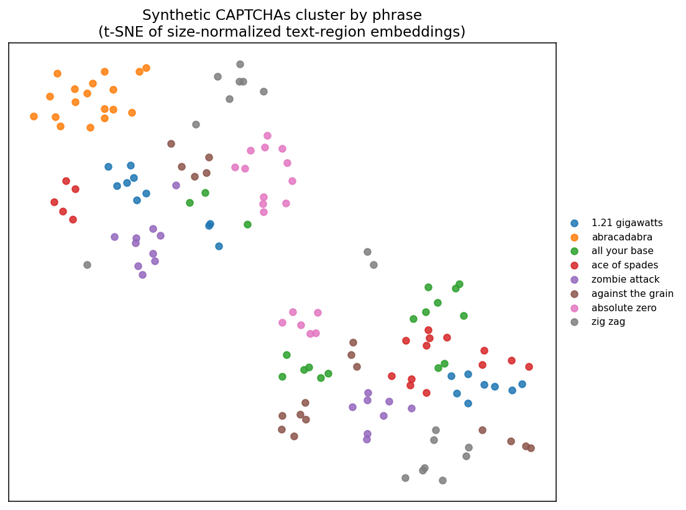
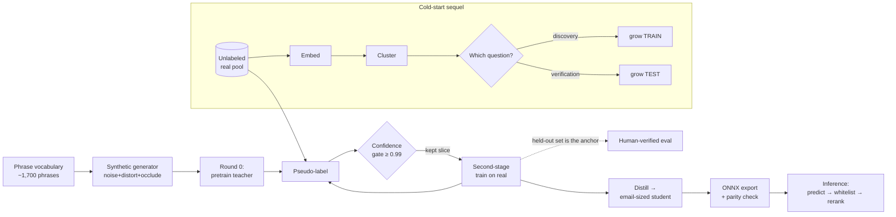

<div align="center">

# glyphloop

**Learning to read distorted text from almost no labels.**

[](LICENSE)
[](pyproject.toml)
[](https://github.com/astral-sh/ruff)
[](https://github.com/beimichen/glyphloop/actions/workflows/ci.yml)

<em>synthetic bootstrap → confidence-gated self-training → knowledge distillation</em>

</div>

---

## What it is

A few years ago some friends and I ran an experiment: *could you teach a model to
read a hard, distorted-text image dataset starting from **zero** labelled
examples?* The dataset was the old, now-defunct **SolveMedia** phrase images —
pop-culture phrases (`"1.21 gigawatts"`, `"all your base"`) rendered with layered
noise, occluders and mesh distortions, drawn from a closed vocabulary of ~1,700
phrases. We used it purely as a convenient source of genuinely hard
distorted-text-over-a-known-vocabulary images.

The interesting artifact was never any particular model — it's the **method**, a
clean semi-supervised recipe that turns "no labels" into a deployable reader:

1. **Synthetic bootstrap.** Hand-build a synthetic image generator and pretrain a
   model on it — enough to read glyphs, not yet to solve the real distribution.
2. **Confidence-gated self-training.** We scraped and organized **~1.3M unlabeled
   real images**, pseudo-labeled them, kept only the high-confidence predictions
   (a precision gate), and trained a second stage on that real distribution —
   closing the synthetic→real domain gap.
3. **Distillation.** Squeeze the accurate-but-heavy model into an email-sized
   student for deployment.

`glyphloop` is that pipeline, rebuilt from the original research code into a
clean, typed, tested Python package — plus the **cold-start sequel** the original
only sketched: *embed → cluster → human-in-the-loop label propagation*, where
"discovery" questions grow the training set and "verification" questions grow the
test set.

> This repository is a **methods showcase**, not a tool for defeating any live
> system. It contains no browser automation, no network/scraping code, and no
> interaction with any CAPTCHA service — SolveMedia is long defunct and is used
> here only as a historical, fixed image domain. See
> [Provenance & honesty](#provenance--honesty).

## Results

Reported from the **original 2022 runs** (the 1.3M-image pool no longer exists, so
these are not re-trainable here — see [Provenance & honesty](#provenance--honesty)):

| Metric | Value |
|---|---|
| Unlabeled real images scraped, organized & pseudo-labeled | **~1.3M** |
| Accuracy on ~1,000 held-out real images | **~99.1%** |
| Self-training rounds to convergence | 3 (synthetic + 2 pseudo-label rounds) |
| Deployed (distilled) student size | **~9 MB** ("email-attachment-sized") |

The accuracy is high for a reason worth being honest about — and it turned out to
say more about the *data source* than the model. See
[The punchline](docs/METHOD.md#the-punchline-a-security-economics-failure-not-an-ml-one).

**What you *can* reproduce today** on a fresh clone (no GPU, no dataset): the
synthetic CAPTCHA generator, the embedding + clustering machinery (the figure
below), the leakage-safe splitting and reranking logic, and the full test suite.

<div align="center">

<br/><sub>Generated by <code>scripts/make_cluster_figure.py</code> — no weights, no committed data. Once
placement/noise are removed, same-phrase renders fall together; this is the premise of the cold-start loop.</sub>
</div>

## How it works



**The precision gate is the whole game.** High-confidence predictions were
empirically almost never wrong, so pseudo-labeling *cleaned* the signal instead of
amplifying noise. Pseudo-labels only ever touch **train**; the human-verified
held-out set stays the anchor — which is what makes clean accuracy *flattening*
(rather than train/test divergence) evidence that confirmation bias never took
hold. Full reasoning in the [Method writeup](docs/METHOD.md).

## Built with

`TensorFlow / Keras` · `ONNX Runtime` · `Pillow` · `scikit-learn` · `Hydra` ·
`DVC` · `pydantic-settings` · `Gradio` · `Streamlit` · `uv` · `Ruff` · `pyright` ·
`pytest` · `GitHub Actions`

## Quickstart

Requires [uv](https://docs.astral.sh/uv/getting-started/installation/).

```bash
git clone https://github.com/beimichen/glyphloop && cd glyphloop
just setup            # create .venv and install (lightweight, no TensorFlow)
just test             # 35 tests, all pure logic — no GPU/data needed
just sample           # render a few synthetic CAPTCHAs to eyeball (gitignored)
just figures          # regenerate the t-SNE clustering figure
```

The default install is intentionally light (NumPy / Pillow / ONNX Runtime /
scikit-learn). The training stack (`uv sync --extra train`) pulls TensorFlow and
is only needed to actually (re)train or export a model.

## Usage

```python
# Synthesize a distorted CAPTCHA for any phrase (the always-runnable part):
from glyphloop.config import IMAGE_SIZE
from glyphloop.data.synthesis import render_text

captcha, phrase, mask, labels, textground = render_text(IMAGE_SIZE, distortion_level=2,
                                                        desired_phrase="abracadabra")
captcha.save("example.png")
```

```bash
# Every training recipe is a composed Hydra config — inspect one without training:
python -m glyphloop.modeling.train train=finetune_real data=real model=student --cfg job

# The method, end to end (needs the [train] extra + an unlabeled image pool):
glyphloop synth --per-phrase 100                       # round-0 synthetic corpus
python -m glyphloop.modeling.train train=pretrain_synthetic data=synthetic
glyphloop selftrain --pool data/raw/unlabeled --teacher runs/pretrain_synthetic/teacher.weights.h5
glyphloop distill   --teacher runs/selftrain/teacher.weights.h5
glyphloop export    --weights runs/distill/student.weights.h5   # -> ONNX (+ parity check)
glyphloop infer     --model models/student.onnx --image example.png
```

The original repo had three near-duplicate training scripts with broken imports;
here there is **one** Hydra-driven trainer and one model zoo
([`modeling/architectures.py`](src/glyphloop/modeling/architectures.py)).

## Project structure

```
src/glyphloop/
  data/        synthesis engine · glossary (one vocabulary) · features · leakage-safe splits
  modeling/    one Hydra trainer · model zoo · distillation · eval · ONNX export
  selftrain/   the confidence gate + round orchestration  (the core method)
  inference/   predict → n-gram whitelist → geometric-mean rerank  (pure, tested)
  embedding/   image embeddings + OPTICS/t-SNE clustering
  active/      discovery (grows train) + verification (grows test) queues
configs/       Hydra groups — one trainer, many recipes
apps/          Gradio synthesis demo · Streamlit labeling tool
tests/         35 pure-logic tests (no GPU/data)
docs/          MODEL_CARD · DATASET_CARD · METHOD (the full story + the punchline)
```

## Reproducibility

Seeds are set across Python / NumPy / TensorFlow (`glyphloop.set_seed`); every path
derives from the project root (no hardcoded `/Users/...` paths, which the original
had everywhere); the data → model DAG is captured in [`dvc.yaml`](dvc.yaml); and
the resolved Hydra config is saved beside every run.

## Provenance & honesty

- **An old experiment, rebuilt.** This is a clean reconstruction of a ~2022
  research project. The original 1.3M-image pool and trained weights are gone and
  were never redistributable, so the headline numbers above are reported as
  *historical results*, not claims re-verified by this repository. Nothing here is
  fabricated.
- **No model weights or image data are committed** — only code, the public phrase
  word-list, and a derived analysis figure (see `.gitignore`). Train your own with
  the pipeline above.
- **Scope.** The original project scraped and organized ~1.3M images at scale (the
  data-engineering half of the work). This **repository ships none of that
  automation** — no browser/scraping/network code, and no interaction with any
  live service. What's on show here is the synthetic data pipeline and the
  semi-supervised method.

## Limitations & next steps

- The committed clustering figure uses a deliberately naive embedding; a learned
  encoder (the `[train]` extra) separates phrases far better — the cold-start
  difficulty is *exactly* that the embedder is weakest before any labels exist.
- **Next:** wire the Streamlit verification tab to a live propagation run; train a
  fresh student and host its ONNX on the Hugging Face Hub to make the Gradio demo a
  clickable public Space.

## License

MIT — see [LICENSE](LICENSE). Author: **Bei Mi Chen** ·
[github.com/beimichen](https://github.com/beimichen)
